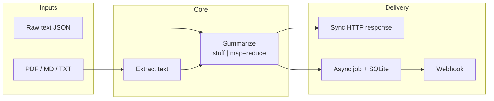

# Interview Q&A — Document summarization & integration (Project F)

*Aligned with **`project-f-document-summarization`**: stuff vs map–reduce summarization, PDF/text extraction, sync vs async APIs, SQLite jobs, HMAC webhooks, optional API keys, Prometheus metrics, and the `DocumentSource` connector pattern.*

**How to use these answers:** Each **Answer** starts with an **easy-to-follow core**; **If they want more:** ties to APIs, ops, and Project F—same pattern as [`interview-qa-rag-senior.md`](interview-qa-rag-senior.md).

---

## Summarization approaches

### 1. What is “stuff” vs “map–reduce” for long documents?

**Answer:** **Stuff** means: put **as much of the document as fits** into **one** model call and ask for a summary—simple and good when the whole thing fits in the **context window**. **Map–reduce** means: **summarize each part** (map), then **summarize the summaries** (reduce)—needed when the document is **too long** for one call.

**If they want more:** Map–reduce costs **more calls** and can lose **global flow** if chunks are cut badly; stuff cannot run at all if the doc is **too large**.

---

### 2. When would you choose “refine” instead of map–reduce?

**Answer:** **Refine** walks the document in order: keep a **running summary** and update it as you read each new chunk—like reading a book chapter by chapter. That often **tracks a story** better than independent chunk summaries.

**If they want more:** Tradeoff: **slower** (harder to parallelize) and mistakes can **compound**. Map–reduce is easier to **parallelize**; refine favors **coherence** on long narratives.

---

### 3. How do you pick chunk size and overlap?

**Answer:** **Larger chunks** keep more **local meaning** but may not fit the model or cost too much. **Smaller chunks** fit the budget but can **split ideas** across boundaries. **Overlap** (repeat a bit between chunks) reduces **cuts through the middle of a fact** but uses **more tokens**.

**If they want more:** Tune with **real eval** and **token budgets**, not only character counts.

---

### 4. What are common failure modes of map–reduce summarization?

**Answer:** The model might **repeat** the same point in every partial summary, **miss** big-picture structure, **merge** conflicting partials into a **made-up** whole, or get **garbage in** from bad PDF extraction (tables, columns scrambled).

**If they want more:** Mitigations: better **extraction**, **overlap**, **hierarchical** summarize-sections-then-doc, **citations** or **human review** for high stakes.

---

## Summarization vs retrieval (RAG)

### 5. How is document summarization different from RAG?

**Answer:** **Summarization** shrinks **a given document** (or small set) into a shorter version. **RAG** answers a **question** by **finding** relevant bits in a **large** collection and then generating—**search + answer**, not “compress this file end to end.”

**If they want more:** You can **combine**: summarize **only the chunks RAG retrieved** when those chunks are long.

---

### 6. When would you use a summarization API instead of “ask the LLM to summarize” inside a RAG app?

**Answer:** When summarization is a **real product feature** (reports, contracts, meeting notes), you want a **stable contract** (length, format), **background jobs** for big files, **webhooks**, **auth**, **metrics**, and **rate limits**—same reasons you wrap any serious capability in a **service**.

**If they want more:** Ad-hoc prompts in another app are fine for demos; a **dedicated API** helps **reuse**, **SLOs**, and **ownership**.

---

## Extraction & formats

### 7. What are limitations of PDF text extraction?

**Answer:** PDFs are **visual layout**, not a clean story. Simple extraction **scrambles** multi-column pages, **misorders** tables, and **fails** on scanned pages unless you add **OCR**. Headers, footers, and footnotes add noise.

**If they want more:** Production paths often add **layout-aware** parsers, **OCR**, or **document AI** vendors when accuracy matters.

---

### 8. What is extractive vs abstractive summarization?

**Answer:** **Extractive** picks **existing sentences** from the source (easier to **trace**). **Abstractive** **writes new sentences** (typical LLMs)—more fluent but easier to **hallucinate** if you do not check against the source.

---

## APIs, async jobs, and integration

### 9. Why offer both synchronous and asynchronous summarization endpoints?

**Answer:** **Sync** is simple for **small** inputs: one request, one response, good for interactive UIs. **Async** is for **large** files: return a **job id** quickly, process in the **background**, then **poll** or get a **webhook**—so the client does not **timeout** waiting minutes for HTTP.

---

### 10. Why sign webhook payloads with HMAC?

**Answer:** The receiver needs to know the payload **really came from your service** and **was not altered** in transit. A **shared secret** lets both sides compute a **signature (HMAC)** over the body; matching signature means **integrity and authenticity** (TLS encrypts; HMAC **authenticates** the payload).

**If they want more:** Also use **HTTPS**, **rotate secrets**, and consider **replay** protection (timestamps, idempotency).

---

### 11. When would you replace `BackgroundTasks` with a queue (SQS, Celery, etc.)?

**Answer:** When one server is not enough: you need **multiple workers**, **retries**, **dead-letter queues**, **survive restarts**, or **fair scheduling** under load. In-process background tasks are fine for **prototypes**; **queues** are the usual **production** pattern.

---

### 12. What is the purpose of a `DocumentSource` abstraction?

**Answer:** It **separates** “where the bytes come from” (S3, SharePoint, Drive, CMS) from “how we summarize.” You add **connectors** per system without rewriting the **core** summarization path.

---

## Security, privacy, and operations

### 13. How do you protect a summarization API?

**Answer:** Require **authentication**, scope data by **tenant/user**, **rate limit** and cap **input size**, use **TLS**, avoid **secrets in logs**, and follow **PII** rules (redaction, retention). For webhooks, **verify signatures** and be careful with **user-supplied callback URLs**.

---

### 14. What metrics matter for an LLM summarization service?

**Answer:** **Latency** (p50/p95), **errors** by stage (extract vs model), **tokens** (cost), **queue depth** for async jobs, **webhook success**, and **user-facing** quality signals. Enough to **alert** and **plan capacity**.

**If they want more:** Prometheus-style **histograms** and **counters** pair well with **Grafana**.

---

### 15. How would you evaluate summary quality in an interview-friendly way?

**Answer:** **Automatic** shortcuts: overlap with a reference (**ROUGE**), **embedding similarity**, or **LLM-as-judge** (use carefully). **Human** checks: **faithfulness** to the source, **coverage** of key points, **length** fit. High-stakes: **citations** or **extractive** spans.

---

## Tradeoffs and “senior” angles

### 16. What is the main cost driver for map–reduce?

**Answer:** **How many LLM calls** you make and **how many total tokens** (every chunk pass plus the merge). Small chunks on a long doc **multiply** cost quickly.

**If they want more:** Optimize with **chunk size**, **cheaper models** for early passes and a **stronger** model only for merge, or **hierarchical** summarization.

---

### 17. Why might a “stub” mode without an API key be useful?

**Answer:** Lets **CI**, **local dev**, and **demos** run **without** real keys or spend. Tests can check **wiring** and **schemas**; full integration runs in a **controlled** environment with keys.

---

### 18. How does summarization relate to “intelligent search” in the same product?

**Answer:** **Search** helps users **find** documents; **summarization** helps them **understand** what they found. Architecturally they are often **separate pipelines**: index for search, call summarization on **selected** or **top** results.

---

## Quick diagram (talking point)

**Talking point (simple):** One **core** path—extract then summarize—can power **sync** UIs, **async** jobs, and **webhooks** depending on how the client wants the result.

---
