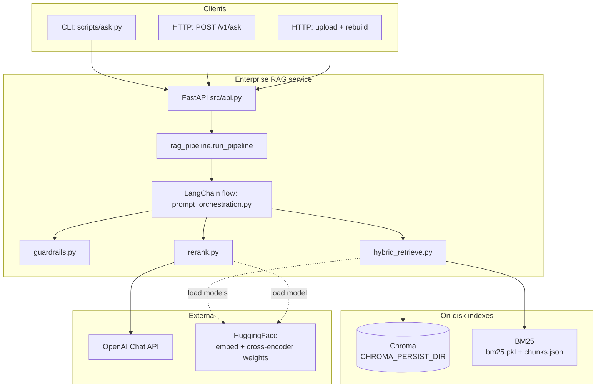
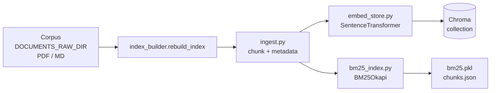
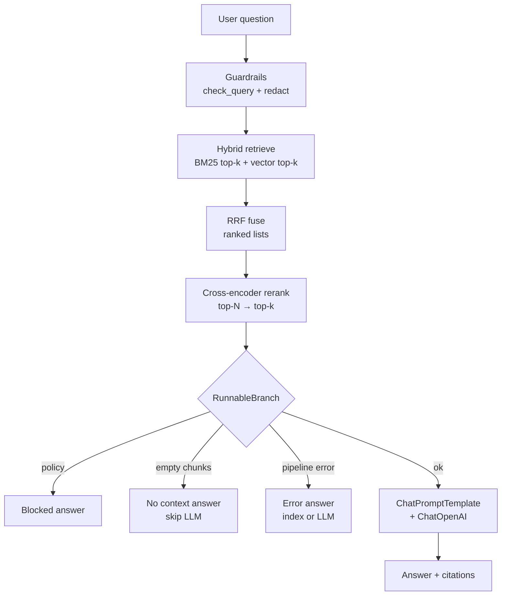
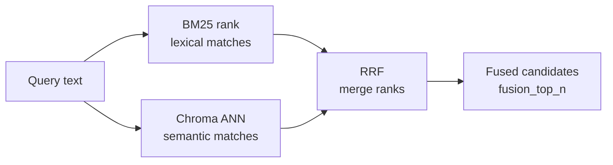
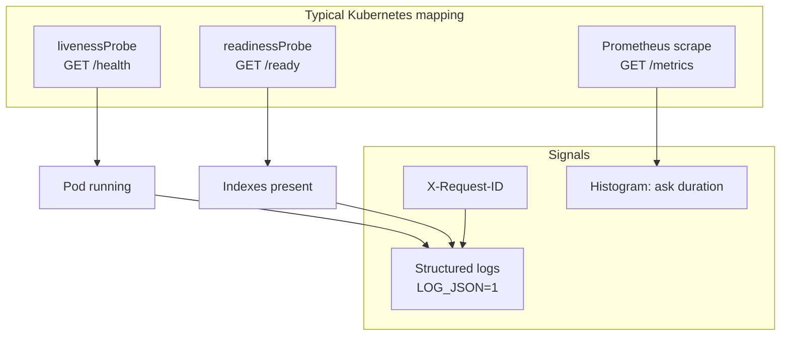

# Interview Q&A — Enterprise RAG (Project B)

*Aligned with `project-b-enterprise-rag`: hybrid BM25 + dense (Chroma), RRF fusion, cross-encoder rerank, guardrails, LangChain orchestration, FastAPI, metrics/readiness, JSONL eval.*

**How to use these answers:** Each **Answer** starts with an **easy-to-follow core**; **If they want more:** adds project paths, APIs, and metrics—same pattern as `[interview-qa-rag-senior.md](interview-qa-rag-senior.md)`.

---

## System design & flow diagrams

*Interview tip: start with the **high-level architecture**, then drill into **query path** or **index build** if the interviewer asks “how does retrieval work?” or “what happens at deploy time?”*

### A. High-level architecture (system context)




---

### B. Index build flow (corpus → vectors + lexical)




*Talking point:* full **rebuild** keeps **chunk IDs** aligned across Chroma and BM25—critical for hybrid retrieval.

---

### C. Query / inference path (end-to-end)




---

### D. Hybrid retrieval detail (why two lists, then fusion)




*Talking point:* **RRF** avoids comparing incompatible score scales; only **ranks** matter.

---

### E. Observability & probes (Phase 4)




---

### F. ASCII sketch (if Mermaid does not render)

Use this on a whiteboard or plain text notes:

```
                    ┌─────────────────────────────────────┐
                    │         FastAPI (src/api.py)         │
  ask.py / curl ──► │  /v1/ask  →  run_pipeline()         │
                    └─────────────────┬───────────────────┘
                                      │
                    ┌─────────────────▼───────────────────┐
                    │ LangChain: guard → retrieve → rerank │
                    │          → branch → LLM or stub      │
                    └─────┬───────────────────┬────────────┘
                          │                   │
              ┌───────────▼──────────┐   ┌─────▼─────┐
              │ Chroma (vectors)     │   │ BM25 +    │
              │                      │   │ chunks.json│
              └────────────────────┘   └───────────┘
                          │                   │
                          └────────┬──────────┘
                                   ▼
                            RRF → cross-encoder
                                   │
                            OpenAI (if API key)
```

---

## Q&A

### 1. What problem does RAG solve that a plain LLM chat does not?

**Answer:** A chat model only “knows” what was in **training** plus what you put in the **prompt**. It can **guess** on your company’s facts. **RAG** first **finds** relevant passages from **your** documents, then answers using those passages—so answers can be **up to date**, **tied to sources**, and the system can **refuse** when nothing relevant was found.

**If they want more:** Grounding, citations, reindexing the corpus instead of retraining weights; reduced fabrication on domain facts when retrieval works.

---

### 2. Walk through the query path in this project at a high level.

**Answer:** The user question is **checked** (guardrails), then the system **searches** both **keyword-style (BM25)** and **vector-style (Chroma)**, **merges** the two ranked lists (**RRF**), **reranks** the short list with a **cross-encoder**, then a **branch** decides: block, no context, error, or call the **LLM** with citations—or return a **stub** without an API key.

**If they want more:** Map to `guardrails.py` → `hybrid_retrieve.py` → RRF → `rerank.py` → LangChain `RunnableBranch` → `prompt_orchestration.py` / OpenAI.

---

### 3. Why chunk documents instead of sending a whole PDF?

**Answer:** Models have **limits** on how much text fits in one request, and **cost** grows with size. **Chunks** let search return **only the few relevant paragraphs** instead of dumping the whole PDF into the prompt—sharper answers and less noise.

**If they want more:** Bad splits hurt tables and sentences; tune **size** and **overlap**.

---

### 4. What is BM25 and when is it stronger than dense retrieval?

**Answer:** **BM25** is a **keyword** scorer: it ranks chunks by how well **words in the query** match the text—no neural “meaning” required. It shines on **exact product codes**, rare strings, and phrases users type verbatim.

**If they want more:** Lexical TF-style scoring; fast and interpretable; weak when the user **paraphrases**—that is where **vectors** help.

---

### 5. What is dense (vector) retrieval doing here?

**Answer:** The system turns the **question** and each **chunk** into **vectors** (embeddings). **Similar vectors** ≈ similar meaning, so search finds relevant text even when wording **differs** from the document.

**If they want more:** SentenceTransformer **bi-encoder** in `embed_store.py`; cosine similarity in **Chroma**.

---

### 6. Why use hybrid retrieval instead of only vectors?

**Answer:** **Vectors** can miss **exact** tokens the user cares about. **Keywords** can miss **paraphrases**. Using **both** and combining results is more **robust** across how people actually ask questions.

**If they want more:** Enterprise search often does **lexical + semantic** for coverage.

---

### 7. Explain Reciprocal Rank Fusion (RRF) in one interview sentence.

**Answer:** RRF **blends several ranked lists** by favoring items that rank **high in any list**, using rank-based scores (e.g. **1 / (k + rank)**), so you **never need** BM25 and vector scores to be on the **same numeric scale**.

---

### 8. Why not just average or normalize BM25 and cosine scores?

**Answer:** Those scores come from **different formulas** and are **not directly comparable**. Mixing raw scores needs fragile tuning. RRF only cares about **order** (rank), which is **consistent** across retrievers.

---

### 9. What is the role of the cross-encoder after fusion?

**Answer:** The **cross-encoder** reads **question + chunk together** and outputs a **relevance** score—usually **more accurate** than “embedding dot product,” but **too slow** to run on every chunk in the corpus. So we only run it on the **small fused shortlist**.

---

### 10. Bi-encoder vs cross-encoder—what would you say in an interview?

**Answer:** **Bi-encoder:** embed question and chunk **separately**, then compare quickly—good for **first search** over millions of chunks. **Cross-encoder:** score **pairs**—slower, better for **final rerank** on dozens of candidates. This project uses both: bi-encoder for **Chroma**, cross-encoder for **rerank**.

---

### 11. What does Chroma provide in this stack?

**Answer:** **Chroma** stores **embedding vectors** for chunks and runs **similarity search** (here persisted on disk under `CHROMA_PERSIST_DIR`). It is the **dense** side of hybrid retrieval alongside **BM25 files**.

---

### 12. Why must BM25 and Chroma stay in sync?

**Answer:** Hybrid fusion and reranking assume **the same chunk IDs and text** in `**chunks.json` / BM25** and in **Chroma**. If one index updates without the other, you can **merge or cite the wrong passage**.

---

### 13. What does guardrails do in this project, and what is it not?

**Answer:** It **blocks** obviously bad inputs (e.g. length, simple lists) and **redacts** patterns that look like **PII** in logs. It is a **light safety layer**, not a full **enterprise DLP or moderation** product.

**If they want more:** Real production adds policy engines, vendor DLP, content moderation APIs.

---

### 14. Why redact PII in logs if the model still sees the query?

**Answer:** **Logs** are copied to many systems, kept a **long time**, and seen by **ops**—higher leak risk than a single model call. Redaction limits **accidental exposure** in observability; model and storage policies are **separate** controls.

---

### 15. What does LangChain add in this codebase specifically?

**Answer:** It **chains** steps—guard → retrieve → rerank—using **Runnable** pieces, and wires **prompt → LLM → parser** without one giant script. `**RunnableBranch`** picks paths (blocked / empty / generate) **explicitly**.

**If they want more:** Easier to add tools, routers, and tests than nested `if` spaghetti.

---

### 16. What is `RunnableBranch` and why use it?

**Answer:** It is LangChain’s way to say **“if state looks like X, run path A; else B”**—so branching stays **visible** in the graph instead of buried in nested conditionals as the pipeline grows.

---

### 17. Why return 503 for some ask failures but 200 for `no_context`?

**Answer:** `**no_context`** means “search ran, nothing useful found”—often a **normal** outcome (and you may **skip** the LLM to save money). **503** signals **something broke** (missing index, upstream outage)—**operators** should page on that, not on empty search.

---

### 18. What is the difference between `/health` and `/ready`?

**Answer:** `**/health`** = “Is the process **alive**?” `**/ready`** = “Can this instance **serve traffic**?” (e.g. indexes loaded). Kubernetes uses **liveness** vs **readiness** probes so bad pods are **restarted** vs **removed from the load balancer**.

---

### 19. Why expose Prometheus `/metrics`?

**Answer:** So you can **dashboard and alert** on **latency**, errors, and rebuilds—same **operability** habit as other production services (Grafana, PagerDuty, etc.).

---

### 20. What is `X-Request-ID` for?

**Answer:** One id per request so **support and logs** can trace a user complaint to **exactly one** HTTP call across services and load balancers.

---

### 21. Why use structured JSON logs (`LOG_JSON=1`)?

**Answer:** JSON fields (`level`, `request_id`, `msg`) parse **reliably** in log platforms; grepping raw strings **does not scale**.

---

### 22. What is the JSONL eval workflow simulating?

**Answer:** A **regression check** for the **pipeline**: after you change chunking, prompts, or retrieval, run `scripts/run_eval.py` on a **fixed gold file** and compare **latency**, **keyword overlap**, **errors**—**not** training the LLM, but **QA for the system**.

---

### 23. What are limitations of keyword-overlap eval?

**Answer:** It only checks if **strings** appear—not whether the answer is **true**, **faithful**, or **useful**. Add **human review**, **LLM judges** with rubrics, or **structured** checks for real quality.

---

### 24. What happens if `OPENAI_API_KEY` is unset?

**Answer:** The service can still return a **stub response** that shows **what chunk would have been used**—handy for **testing the index** without API cost.

---

### 25. What are the main latency drivers at query time?

**Answer:** Usually **embedding the query**, **BM25 + vector search**, **cross-encoder rerank**, and **LLM generation**. Often **rerank + LLM** dominate end-to-end time.

---

### 26. Why full reindex instead of incremental updates (as in this design)?

**Answer:** **Rebuild everything together** so **IDs and embeddings** never drift apart—simple and **correct**. Tradeoff: slower refresh; at scale you might add **incremental** or **background** jobs.

---

### 27. How would you secure the HTTP API in production?

**Answer:** **Auth** (API keys, OAuth, mTLS), **TLS**, **rate limits**, **private** metrics endpoints or `**METRICS_REQUIRE_AUTH`**, and **no secrets in git**. Tune exposure of `/health`/`/ready` to your **threat model**.

---

### 28. When would you replace on-disk Chroma with a managed vector DB?

**Answer:** When you need **higher QPS**, **high availability**, **multi-tenant** isolation, or you **do not** want to run vector storage yourself. Ideally swap only the **retrieve** layer and keep **chunk contracts** and **citations** stable.

---

### 29. What failure modes should you mention for hybrid RAG?

**Answer:** **Broken or empty index**, **bad chunking**, **noisy fusion**, **rerank too slow**, **LLM timeouts**, **thin context** leading to **hallucination**. Mitigate with **no-context** paths, **prompts**, **monitoring**, and **evals**.

---

### 30. How do you explain “enterprise RAG” vs “demo RAG” in one line?

**Answer:** **Enterprise** adds **real search stack** (hybrid + rerank), **safety hooks**, **metrics and health**, **request tracing**, and **eval loops** so you can **operate** it—not just a notebook that calls an API once.

---

## Generic AI / ML (mid–senior)

*Role-agnostic themes: lifecycle, evaluation, production, LLMs, risk. Use as bridges when interviewers zoom out from one project.*

### 31. How do you describe the ML lifecycle in production versus a Kaggle-style workflow?

**Answer:** A **Kaggle** sprint fits a **frozen dataset** and a **single leaderboard number**. **Production** needs **pipelines**, **refresh or retrain plans**, **deployments**, **monitoring**, **rollback**, and **rules**—because the world **changes** and the system must keep working under **latency, cost, and compliance**.

**If they want more:** Sustained correctness under **drift** beats one-time model accuracy.

---

### 32. What is the difference between data leakage and train/test contamination?

**Answer:** **Contamination** is a **classic mistake**: letting **test** information into **training** (e.g. fitting scaler on full data before split). **Leakage** is broader—**any** shortcut that makes training easier than real life (duplicate rows, future data, target peeking). Both make **offline metrics lie**.

---

### 33. When would you prioritize precision over recall (or the opposite)?

**Answer:** **Precision** = “when we say yes, we’re usually right” (important when **false alarms** are costly—fraud blocks, bans). **Recall** = “we catch most of the real positives” (important when **missing** one is costly—safety, screening). You pick the metric that matches **business harm**, then tune thresholds; **F1** is a middle ground when both matter.

---

### 34. How do you think about bias and fairness without claiming a solved problem?

**Answer:** Name **who is harmed** and **how** (wrong denial, stereotype, worse quality for a dialect). Improve **data and labels**, **measure subgroups**, add **human review** where needed, and **document limits**—fairness is **contextual**, not one number.

---

### 35. RAG vs fine-tuning vs prompt engineering—when would you pick each?

**Answer:** **Prompts** first—cheapest. **RAG** when facts **change** or must be **cited**. **Fine-tuning** for **style, format, or behavior** the model won’t reliably follow from prompts—not as a substitute for **fresh facts** that change weekly.

**If they want more:** Often **combine** all three lightly.

---

### 36. What is “good enough” model quality in production?

**Answer:** Good enough = **meets product SLAs** (speed, cost, uptime) with **acceptable errors** on **realistic** traffic, plus **monitoring** and **fallbacks** when things slip. Chasing tiny offline gains while **ops cost** explodes is a common trap.

---

### 37. What would you monitor after deploying a model or LLM feature?

**Answer:** **Inputs and outputs** (drift), **latency/errors**, **downstream business metrics**, **data quality**, and for LLMs **abuse/safety**. Use **canaries** or **shadow** traffic before full rollout.

---

### 38. Explain concept drift in one sentence.

**Answer:** **Concept drift** means the **mapping from inputs to the right answer** changes over time (e.g. customers behave differently), so an old model becomes **wrong** even if inputs “look similar.”

---

### 39. What is the difference between batch and online inference?

**Answer:** **Batch** = score many rows on a **schedule** (nightly)—optimize **throughput and cost**. **Online** = one request at a time in **milliseconds to seconds**—optimize **latency and reliability**. Many systems **precompute** heavy parts and **serve** light models online.

---

### 40. How do GPUs help ML training and inference?

**Answer:** GPUs run **large matrix math** in parallel—faster **training** and **high-throughput inference** for big neural nets. They are **not** always needed: small models or light loads may be **CPU**-fine; **IO and memory** often matter too.

---

### 41. What is transfer learning at a high level?

**Answer:** Train a big model on **broad data**, then **adapt** to your task with less data than training from scratch—this is the usual story for **foundation models** and most NLP/CV deployments.

---

### 42. How would you design an A/B test for a ML-powered product change?

**Answer:** Pick **primary** metrics (e.g. conversions) and **guardrails** (latency, errors). **Randomize** users, **size** the test for realistic effects, avoid **biased peeking**, watch for **network effects**. Ship when **product and ops** metrics align with agreed tradeoffs.

---

### 43. What is prompt injection in LLM systems?

**Answer:** **Untrusted text** tries to **override** your instructions (“ignore previous rules…”). Defense: **clear trust boundaries**, **separate system vs user vs retrieved content**, **tool allowlists**, **output filters**, **no secrets in prompts**, **humans** for risky actions.

---

### 44. What is the role of an experiment tracking tool (e.g. MLflow, W&B) in a team?

**Answer:** It stores **settings, data pointers, metrics, artifacts** so experiments are **comparable and reproducible**—important for **collaboration** and **audit**, not just personal notebooks.

---

### 45. When would you *not* use deep learning?

**Answer:** When data is **small and tabular**, you need **interpretability**, **extreme latency**, or a **simple model** already hits the SLA. Deep learning shines on **large unstructured** data; it is **overkill** when simpler tools win.

---

### 46. What is the cold-start problem in recommendation or personalization?

**Answer:** **New users or items** have **no history**, so “people like you” signals are weak. Mitigations: **content features**, **popular defaults**, **onboarding**, **explore/exploit**—as much a **product/data** problem as an algorithm tweak.

---

### 47. How do you explain “technical debt” in ML systems?

**Answer:** Skipping **tests, versioning, monitoring, automation** makes every future change **scarier**—like interest on a loan. Paying down means **reproducible data**, **CI**, **observable** services, and **honest** metrics.

---

### 48. What is the difference between autoregressive and encoder–decoder models?

**Answer:** **Autoregressive** (GPT-style) predicts **next token** from prior tokens—great for **open generation**. **Encoder–decoder** maps **input sequence → output sequence** (classic translation/summarization); many products now use **decoder-only** + prompts instead.

---

### 49. How do you set expectations for stakeholders on LLM reliability?

**Answer:** These models are **probabilistic**—they will **sometimes fail**. Agree on **acceptable failure modes**, **fallbacks** (human, retrieval, refusal), **escalation**, and **continuous eval**; align **risk** with **where humans stay in the loop**.

---

### 50. What does “responsible AI” mean in practice on a team you lead?

**Answer:** **Assigned owners** for privacy, security, bias review, incidents, and user-facing documentation—not a slide deck alone. **Process**: checklists, reviews, logging, **postmortems** when something goes wrong.

---

*Generated for study — map answers back to `README.md` and `src/` for code-level follow-ups. **Diagrams:** render Mermaid in GitHub, VS Code / Cursor (Markdown preview), or [mermaid.live](https://mermaid.live).*