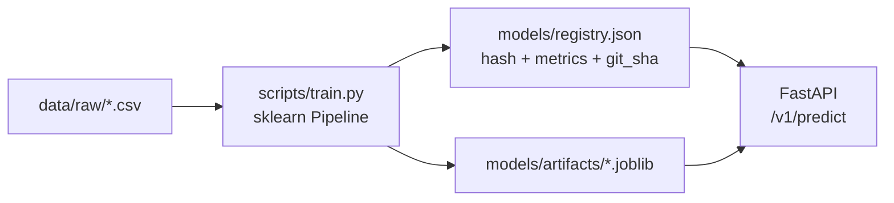
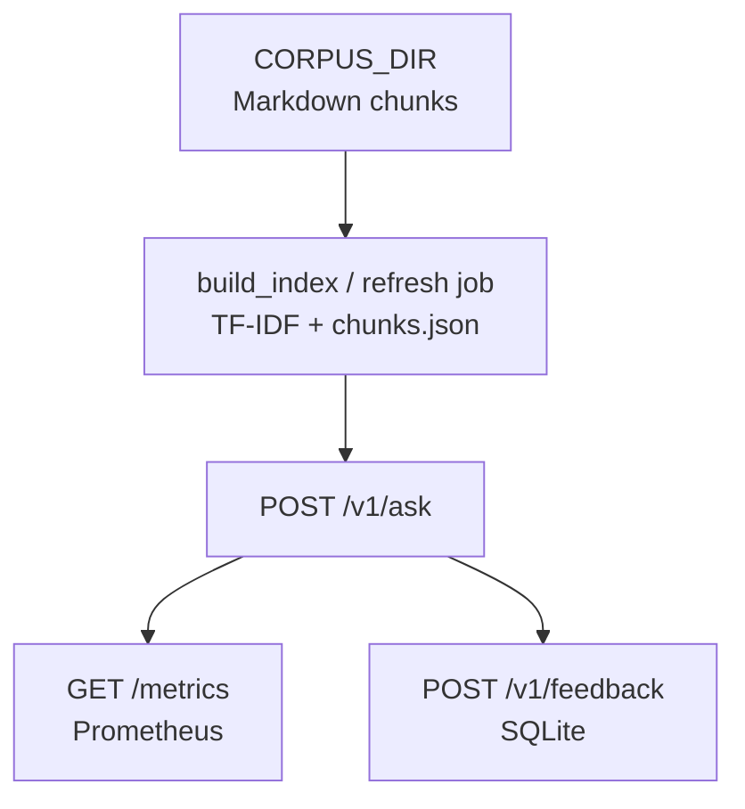

# Interview Q&A — ML API & pipeline (D) + RAG “MLOps” (E)

*Aligned with **`project-d-ml-api-pipeline`** (tabular classifier, FastAPI, Docker, CI/CD, model registry / lineage) and **`project-e-rag-mlops`** (TF-IDF RAG, Prometheus metrics, SQLite feedback, refresh job, drift docs).*

**How to use these answers:** Each **Answer** starts with an **easy-to-follow core**; **If they want more:** names Projects D/E and ops detail—same pattern as [`interview-qa-rag-senior.md`](interview-qa-rag-senior.md).

---

## System design (quick diagrams)

### Project D — train → register → serve

**Talking point (simple):** **Training** produces an **artifact**; the **registry** records **which data and code** built the model that **serving** loads.

---

### Project E — corpus → index → ask + observe + feedback

**Talking point (simple):** **Metrics** and **feedback** are first-class paths—not something you bolt on after launch.

---

## Project D — ML API, containers, CI/CD, lineage

### 1. Why wrap a model in FastAPI instead of calling sklearn from a script?

**Answer:** A **web API** gives other teams and apps a **stable URL and contract** (JSON in/out), validation, auth, and scaling behind a load balancer. A **script** is fine for **training**; **production inference** is almost always **HTTP or gRPC**.

**If they want more:** FastAPI + **Pydantic** for schemas, **version headers**, health checks.

---

### 2. Should ML inference endpoints be `async` in FastAPI?

**Answer:** Use **`async`** when the handler mostly **waits** on I/O (remote LLM, S3). For **CPU-heavy** `sklearn.predict` on small batches, a normal **`def`** (often with a **thread pool**) is often simpler—`async` does not make numpy use all cores by itself.

**If they want more:** **Profile** before complicating.

---

### 3. Why serialize models with `joblib` for sklearn pipelines?

**Answer:** **`joblib`** saves **numpy-heavy** sklearn pipelines efficiently. For **PyTorch/ONNX**, you’d use **formats your serving stack** expects (TorchScript, ONNX, etc.).

---

### 4. What goes in a “model registry” file versus MLflow or a cloud registry?

**Answer:** A **small JSON registry** answers: **which file is live**, **what metrics** it had, **what data hash** and **git commit** built it—enough to **reproduce and debug**. **MLflow / cloud registries** add **experiments**, **staging**, **RBAC**, **audit**—needed when many people ship models.

**If they want more:** Start simple; **grow** when collaboration and compliance require it.

---

### 5. Why record `data_sha256` and `git_sha` in lineage?

**Answer:** When quality drops, you need to answer **exactly what data** and **what code** produced this model. Without hashes, you cannot **rebuild** or **compare** runs honestly.

---

### 6. How does DVC relate to this project?

**Answer:** **DVC** versions **large data and models** in remote storage with small pointers in Git. This repo uses a **registry + files** pattern; you’d add DVC when data is **too big for Git** or you want **`dvc repro`** pipelines.

---

### 7. What is the point of baking `train` into the Docker build?

**Answer:** The image is **self-contained** from a **commit**—great for **demos** and **immutable** releases. Tradeoff: **slow builds**; big teams often **build once** and **pull artifacts** at runtime.

---

### 8. What would you mount at runtime instead of baking the model?

**Answer:** A **volume** or **S3-style URI** loaded on startup so you can **swap models** without rebuilding the image and keep **secrets** out of image layers.

---

### 9. What belongs in CI for an ML API service?

**Answer:** **Lint**, **unit tests** (shapes, errors), **Docker build**, optional **smoke** `predict`. **Training** every commit is usually **overkill** unless trains are **cheap**—often train on **schedule** or **data change**.

---

### 10. What belongs in CD to “staging”?

**Answer:** **Build** image, **push** to registry with a **tag** (e.g. commit SHA), **deploy** to staging with **prod-like** env, run **health checks** and **synthetic** requests before **promoting** to prod.

---

### 11. How do Cloud Run / App Runner / small VMs differ for this API?

**Answer:** **Serverless** containers **scale to zero** and bill per request—watch **cold start** with heavy dependencies. **VMs** give **steady CPU** and long-lived processes. Pick from **traffic pattern** and **latency SLO**.

---

### 12. How do you version HTTP APIs—`/v1/predict`?

**Answer:** **Version in the URL or headers** so you can ship **breaking** JSON changes without silently breaking old clients; keep **old versions** for a **deprecation window**.

---

### 13. What is a production-ready failure response for `/v1/predict`?

**Answer:** **4xx** for bad client input, **5xx** for server/model errors, include a **request/correlation id** for logs, **never** raw stack traces to the client.

---

## Project E — monitoring, feedback, refresh, drift

### 14. What should you monitor for a RAG service beyond generic HTTP latency?

**Answer:** **Retrieval**: did we get chunks? how many? score distribution? **LLM**: tokens, errors, rate limits. **Product**: thumbs down, escalations. That tells you whether **bad answers** are **search** vs **generation**.

---

### 15. Why expose Prometheus `/metrics` instead of only application logs?

**Answer:** **Metrics** are **cheap to aggregate** and **alert** on (p95, error rate). **Logs** are rich but **expensive** at volume. Use **both**: metrics for **dashboards**, logs for **debugging one request**.

---

### 16. What is “retrieval hit rate” in plain language?

**Answer:** **What fraction of questions** get at least one retrieved chunk above your **quality bar** (or any chunk at all). **All misses** often means **index gap** or **query/doc mismatch**, not “the LLM is dumb.”

---

### 17. Why track an estimated token counter if you have real usage from the provider?

**Answer:** **Stub** or **offline** runs do not return **billing metadata**; rough **char/4** estimates still let you **compare** environments. In prod, prefer **provider usage** when available.

---

### 18. What is the feedback loop for thumbs up/down?

**Answer:** Store **rating + request id + optional correction** for **later labeling**, **prompt tuning**, or **fine-tune datasets**—after **sampling**, **de-biasing**, and **PII** review. It is **not** automatic magic retraining.

---

### 19. What are limitations of thumbs-only feedback?

**Answer:** **Sparse**, **biased** toward angry users, and **ambiguous** (bad answer vs bad policy). Add **reason codes**, **corrections**, and **periodic human eval**.

---

### 20. What does a scheduled **refresh** job do for RAG?

**Answer:** **Rebuilds the search index** when **documents change** (here TF-IDF + `chunks.json`). Trigger on **cron**, **queue**, or **“new file landed”** events.

---

### 21. How would you detect **drift** in retrieval quality?

**Answer:** Watch **offline** eval (nDCG/MRR on a **labeled** set per index version) and **online** stats: **hit rate**, similarity scores, **“no context”** rate, **feedback** trends. **New products** not in docs vs **new user slang** are different problems.

---

### 22. When would you re-embed vs. re-chunk?

**Answer:** **Re-chunk** when **structure** hurts (sections too big, mixed topics). **Re-embed** when you change **embedding model** or **dimensions**. Both mean a **new index version**—track it in **metadata and metrics**.

---

### 23. Why might TF-IDF be enough for a learning project but not for production semantic search?

**Answer:** TF-IDF matches **words**, not **meaning**—great for **keyword overlap**, weak for **paraphrases** and **multilingual semantics**. Production often uses **dense embeddings** and often **hybrid** with lexical (as in Project B).

---

### 24. What is one thing you’d learn from deploying a **toy** on SageMaker / Vertex / Azure ML?

**Answer:** The **managed ML flow**: register **artifact** → pick **compute** → create **endpoint** → **invoke** with **IAM/roles**. Even if your app stays on **Cloud Run**, you understand how **enterprise ML platforms** expect artifacts and permissions.

---

### 25. How do latency vs. accuracy tradeoffs show up in RAG MLOps?

**Answer:** **More retrieval** (higher k, rerankers) and **bigger models** usually **improve quality** but **raise latency and cost**. You set **budgets**, measure **p95/p99**, and tune **k**, model tier, and **caching**.

---

### 26. How would you secure `/metrics` and `/v1/feedback` in production?

**Answer:** **Metrics**: internal network or **auth** on scrape—do not expose **Prometheus** admin to the public. **Feedback**: **authenticate**, **rate limit**, **sanitize** stored text for **PII**.

---

## Cross-cutting (D + E)

### 27. How do Project D and E differ in “MLOps” emphasis?

**Answer:** **D** is **classic ML serving**: train → **versioned artifact** → **predict API** → **CI/CD**. **E** adds **LLM/RAG ops**: **retrieval metrics**, **tokens**, **human feedback**, **refresh**—closer to **LLMOps** patterns.

---

### 28. How does this tie to a “capstone” portfolio story?

**Answer:** You can tell one arc: **lineage and deployment** (D), **RAG quality and observability** (E + B patterns), plus **auth and cost** at scale—**managed vector DB**, **queues** for indexing, **separate metrics tier**.

---

## One-liner cheat sheet

| Topic | One sentence |
| --- | --- |
| **Registry** | Know which **data + code + artifact** is live. |
| **CI** | Block bad merges with **lint + tests**. |
| **CD** | Ship **immutable images** to **staging** first. |
| **RAG metrics** | Watch **retrieval** + **LLM** + **cost** together. |
| **Feedback** | Capture **signal** for **labeling**, not magic self-healing. |
| **Drift** | **Detect** with **eval sets + live stats**, then **refresh** or **fix data**. |
