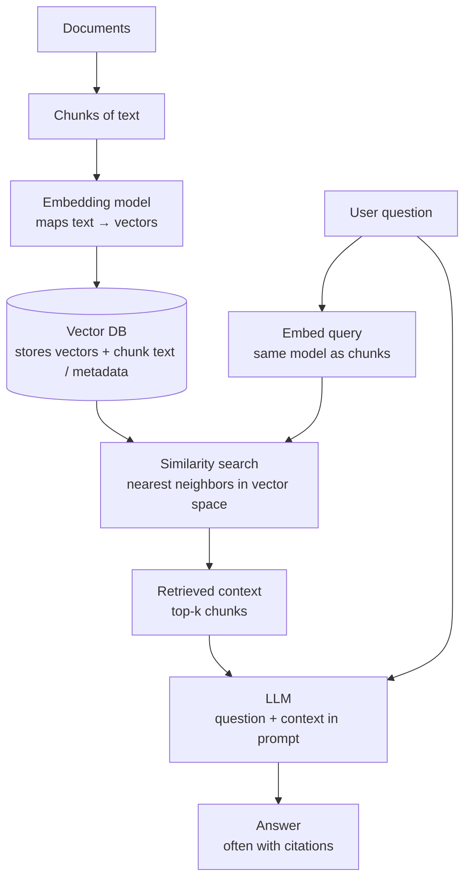

# Interview Q&A — RAG (senior / staff level)

*Role-agnostic **retrieval-augmented generation** themes: architecture, retrieval quality, evaluation, security, scale, and operations. Complements project-specific notes in [`interview-qa-enterprise-rag.md`](interview-qa-enterprise-rag.md) and retrieval threads in [`interview-qa-nlp-senior.md`](interview-qa-nlp-senior.md).*

**How to use these answers:** Each **Answer** starts with an **easy-to-follow core** (what you’d say first in an interview), then adds **short detail** for follow-up questions—tradeoffs, names, and metrics.

**Interview tip:** Senior answers still emphasize **tradeoffs**, **failure modes**, **what you measure**, and **how you’d roll back**—but you earn trust faster when the first sentence is plain English.

---

## One-page architecture: embeddings → vector DB → RAG → answer

*Use this on a whiteboard or as the first slide: **index path** (build the library), then **query path** (answer a question). The **Vector DB** connects both.*



**Talking points (easy version):**

1. **Embeddings** — The model turns each piece of text into a list of numbers (a vector). Texts with similar meaning get vectors that sit close together in math space, so the computer can search by “meaning,” not only keywords.
2. **Vector DB** — A database built to store those vectors and the original chunk text (and metadata). It finds the **nearest neighbors** to the query vector very fast (approximate nearest neighbor, ANN).
3. **RAG** — **R**etrieval **a**ugmented **g**eneration: first **fetch** the best matching chunks from the DB, then **give** those chunks plus the user question to the LLM so the answer can stay tied to **your** documents.
4. **Answer generation** — The LLM writes the reply using the retrieved passages as evidence; citations are possible because you know which chunks you passed in.

**ASCII sketch** (if Mermaid does not render):

```
  Documents → chunk → embedding model ──► Vector DB (vectors + chunk text)
                                                │
  User question ──► embed query ───────────────► similarity search
                                                │
                                                ▼
                                    top-k chunks as “context”
                                                │
                    User question ──────────────┴──► LLM ──► answer
```

---

## Strategy: when RAG, when not

### 1. How do you decide between RAG, fine-tuning, and long-context “stuff everything in the window”?

**Answer:** Think of three knobs: **where the knowledge lives**, **how the model behaves**, and **how much text fits in one request**. **RAG** is for knowledge that **updates often**, must be **quoted from sources**, or is **too big** to memorize inside model weights—you keep facts in a document store and **look them up** at question time. **Fine-tuning** teaches the model **habits**: tone, format, or patterns (it is not a great way to stuff in facts that change every week). **Long context** works when **everything important fits** in one window and you accept the **cost and latency** of sending a huge prompt—fine for small corpora, painful at scale.

**If they want more:** Teams often combine **RAG + clear prompts** and sometimes a **light fine-tune** for style. RAG’s downside is you must run and monitor **search + generation**, not just a chat model.

---

### 2. What does “good RAG” optimize for beyond “the answer sounds right”?

**Answer:** A fluent answer can still be **wrong** or **unsafe**. “Good” usually means: answers are **grounded** in retrieved text (not invented), retrieval **finds the right passage** when it exists in the corpus, the system is **fast and affordable enough** for the product, **private data stays private** (e.g. per-tenant isolation), and you can **ship updates and roll back** indexes without chaos. You pick a **small set of metrics** that match risk—e.g. stricter faithfulness checks in regulated settings, or recall-focused retrieval metrics for support bots.

**If they want more:** Mention **offline** eval (golden questions) and **online** signals (latency, empty retrieval rate, thumbs-down, escalations to humans).

---

## Chunking, parsing, and the index

### 3. How do you choose chunk size and overlap—and what goes wrong if you guess?

**Answer:** You split documents into **chunks** because the model cannot send whole libraries at once. **Smaller chunks** → sharper search hits, but you may **cut sentences, tables, or definitions in half**. **Larger chunks** → more context per hit, but noisier retrieval. **Overlap** (repeating a few sentences between chunks) reduces “bad cuts” but **stores duplicate text** and can surface the same fact twice. You tune using **real questions**: either labeled data or spot-checks, and you watch for **junk duplicates** in the top results.

**If they want more:** Prefer splitting on **headings or sections** when the document has structure; fixed token windows are a simple default, not always the best.

---

### 4. What is “late chunking” or embedding full documents vs chunks—when would you mention it?

**Answer:** Instead of embedding tiny pieces first, some systems embed **longer spans** (or whole pages) so the vector **captures wider context**, then they **narrow down** to the exact sentences for the LLM. The idea is to reduce mistakes when meaning **spreads across** several sentences.

**If they want more:** Tradeoff: **cost** (big inputs to the embedder) and **blurry retrieval** (one vector for a long page may match too broadly). People mention this when the interviewer asks about **errors at chunk boundaries**.

---

### 5. How do PDFs and OCR change your ingestion story?

**Answer:** A PDF is not “a string of paragraphs”—it is **layout**. Copy-paste can scramble **columns**, **headers**, and **tables**. **OCR** (scanning images to text) adds **typos** that keyword search will miss. So the hard part is often **clean extraction**, not the neural network on top.

**If they want more:** Use **parsers that understand layout**, clean up known noise, keep **metadata** (page number, file id) for debugging, and sample-check quality—**bad text in → bad retrieval out**, no matter how fancy the embedding model is.

---

## Retrieval: dense, sparse, hybrid, and beyond

### 6. How do you explain “embedding model mismatch” and domain adaptation?

**Answer:** Embeddings are trained on some **typical text** (often general web language). In a **niche domain**—medicine, law, internal codes—**the same words can mean different things**, and the model may place important phrases **too far apart** in vector space. Symptoms: search “feels blind,” but **keyword (BM25) search** still finds things; or clusters of your docs look wrong when you visualize them.

**If they want more:** Fixes include **domain-specific embedding models**, **hybrid** keyword + vector search, **rerankers** tuned on your data, **query expansion**, and careful **evaluation** on held-out real questions so you don’t overfit a demo set.

---

### 7. What query transformations would you use before hitting the vector index?

**Answer:** Sometimes the user’s question is **not** the best string to search with. You can **rewrite** it (clearer or shorter), generate a **fake short answer** and embed *that* (HyDE—hypothetical document), split one question into **several sub-questions** for multi-step facts, or ask a **more general “step-back”** question first. Each trick can help—or **hurt** if the rewrite drifts off topic.

**If they want more:** Every extra step costs **latency and money**. Use **caching**, only rewrite when **confidence is low**, and **measure** whether rewrites help your actual traffic.

---

### 8. When would you add a knowledge graph (GraphRAG) or structured retrieval—and what is the cost?

**Answer:** Use a **graph** when the user cares about **relationships**: who owns what, which rule overrides which, dependencies between parts—not only “a paragraph mentions both words.” Pure chunk search can **miss** those links if they sit in different chunks.

**If they want more:** Graphs cost **design time** (what is a node/edge?), **extraction** (errors propagate), **updates**, and **query tooling**. A common pattern is **hybrid**: graph for **structure and filters**, vectors for **messy text**, combined in the prompt or via **tools** the model calls.

---

### 9. How do you reason about ANN index parameters (e.g. HNSW `efConstruction`, `M`) in production?

**Answer:** These knobs control the **speed vs accuracy** tradeoff for **approximate** nearest-neighbor search. **Higher quality** settings usually mean **more memory**, **longer index build**, and sometimes **slower queries**—but fewer cases where the **true best match** is missed.

**If they want more:** Tune on **your** vectors and **your** SLOs: benchmark recall/latency with labeled or pseudo-labeled pairs, then **revisit** when you change the **embedder** or **scale** the corpus.

---

## Reranking, fusion, and multi-stage retrieval

### 10. Why a two-stage retrieve-then-rerank pipeline instead of “best single retriever”?

**Answer:** **Step 1** is built for **speed and breadth**: “give me a few hundred likely candidates” (vector search and/or keyword search). **Step 2** is built for **accuracy**: a heavier model scores **query + passage** pairs and **reorders** the short list. One giant slow model over the whole index usually does not scale; one fast model alone often **misses** exact keywords or **fine-grained** relevance.

**If they want more:** This pattern (wide net → narrow rerank) is easy to explain in system design and maps to **bi-encoder + cross-encoder** setups.

---

### 11. What is ColBERT-style retrieval, and where does it sit vs cross-encoders?

**Answer:** **Bi-encoder** = encode query and document **separately**, then compare vectors (fast, good for first pass). **Cross-encoder** = feed **query and document together** into one model (slower, more accurate). **ColBERT-style** sits in the middle: it keeps **per-word** vectors for query and doc and scores with **lightweight comparisons**—often **better than bi-encoder**, **cheaper than full cross-encoder** at large scale, with more **engineering** complexity.

**If they want more:** Typical stack: fast retrieval → **ColBERT or similar** on a medium set → **cross-encoder** on the **final few** if budget allows.

---

### 12. How do you handle duplicate or near-duplicate chunks in the candidate list?

**Answer:** If the top results are **almost the same paragraph repeated**, you waste **context window** and the model may **over-trust** repeated text. Fix it at **index time** (deduplicate or hash similar chunks), at **ranking time** (diversity methods like MMR), or with **rules** (e.g. one window per document section).

**If they want more:** In eval, check not only **top-1 accuracy** but whether the model received **distinct evidence**.

---

## Generation, grounding, and citations

### 13. What is the difference between attribution, faithfulness, and correctness in RAG eval?

**Answer:** Three different questions: **Did the answer point to sources?** (attribution / citations.) **Did the answer stay within what those sources actually say?** (faithfulness—not making things up beyond the text.) **Is the answer true in the real world?** (correctness—even faithful text can be **wrong** if your documents are outdated or incorrect.)

**If they want more:** RAG mainly helps with **faithfulness to the corpus**; **correctness** still depends on **human process** and **fresh data**.

---

### 14. How do you reduce hallucination when retrieval returns weak or contradictory evidence?

**Answer:** Tell the model clearly: **only use what was retrieved**, and **say “I don’t know”** if the text is not enough. Add **rules**: if scores are **too low** or chunks **disagree**, don’t force a confident answer—offer **both sides with citations** or **escalate to a human**. **Structured outputs** (bullet + source id) make bad behavior easier to spot.

**If they want more:** LLM-based judges can help at scale but need **human calibration**; always test on **contradiction** and **empty-context** cases.

---

### 15. What is “lost in the middle” and how does it affect RAG prompts?

**Answer:** Research shows models sometimes **pay less attention** to text placed in the **middle** of a long prompt. For RAG, that means burying your best evidence **between** fluff can **hurt** answer quality even when retrieval was right.

**If they want more:** Mitigations: put **strongest chunks at the start or end**, **shorten** context, **summarize** long passages, or **retrieve again** in a second step. **How you pack context** matters as much as **how many** chunks you retrieve.

---

## Agentic and tool-using patterns

### 16. How does “agentic RAG” differ from a single retrieve-then-generate chain?

**Answer:** **Classic RAG** is often **one round**: search once, answer once. **Agentic RAG** means a **planner or loop**: the system may **search multiple times**, **break the question into parts**, or **call tools** (database, API, calculator) before answering. That helps **multi-step** questions but adds **unpredictable runtime** and **more ways to fail**.

**If they want more:** Production needs **caps** (max steps, max cost), **allowed tools only**, and **logging per step** for debugging.

---

### 17. Where would you use metadata filters in retrieval—and what breaks?

**Answer:** Filters narrow results by **facts about the document**: date, product line, **which customer** the data belongs to, document type. They are essential for **permissions** (only search docs this user may see) and **freshness** (only recent policies).

**If they want more:** Failure modes: **too strict** filters → **no results**; **wrong or missing tags** → the right document is **silently excluded**. Monitor **empty results** and audit **metadata quality**.

---

## Security, privacy, and compliance

### 18. How does RAG change the threat model for prompt injection?

**Answer:** **Prompt injection** is when untrusted text tricks the model into **ignoring instructions**. In RAG, **your documents are text you feed into the prompt**—so a **malicious or hacked document** is almost like a **user message** trying to steer the model. The model may obey **hidden instructions inside a PDF** if you are not careful.

**If they want more:** Separate **system instructions** from **retrieved content** clearly, **restrict tools**, filter outputs, avoid **secrets in prompts**, and treat ingested content as **untrusted input**.

---

### 19. How do you design multi-tenant RAG so one customer never sees another’s chunks?

**Answer:** Isolation must be **enforced when you search**, not only hidden in the UI. Typical patterns: **separate index per tenant**, **strict filters** on every query (e.g. `tenant_id` must match), or **row-level security** in the backing database. **Tests** should prove that **cross-tenant** queries return **nothing**.

**If they want more:** Sharing one physical index is OK if **every query** applies correct filters—get **security review**; mistakes here are **data breaches**, not just bad relevance.

---

## Scale, latency, and cost

### 20. What are the main levers to cut p95 latency in a RAG API?

**Answer:** **Fewer candidates** before the slow reranker, **run** keyword and vector search **in parallel**, **cache** repeated queries or embeddings, use a **smaller or distilled** reranker, place services **close to users/data**, and **stream** LLM tokens so the user sees output sooner. **Measure first**: often **reranking and the LLM** dominate time.

---

### 21. How would you cache RAG results without serving stale answers?

**Answer:** Cache keys should include **what you searched** and **which index version** produced the hits—so after a **reindex**, you don’t return answers from **old documents**. Use **short TTLs** for fast-changing topics. Optionally cache **only retrieval results** (chunks), not the **final** LLM text, so **prompt updates** still take effect.

**If they want more:** Return an **index or build id** in the API for support and debugging.

---

### 22. How do you think about cost allocation for a RAG product?

**Answer:** Split the bill into **building the index** (embedding all chunks, storage), **each question** (embed query, vector search, reranker, LLM tokens), and **reindexing** when docs change. **Bigger chunks or higher k** → more **LLM tokens**; **frequent full reindexes** → more **embedding** cost.

**If they want more:** Tie cost to **business outcomes** (e.g. cost per resolved ticket) so you don’t optimize **model scores** in a vacuum.

---

## Evaluation, monitoring, and continuous improvement

### 23. What would you put in a RAG-specific offline eval suite?

**Answer:** **Retrieval:** “Did we fetch the right document?”—using labeled question–answer pairs or synthetic tests; metrics like **recall@k** or **MRR**. **Generation:** “Is the answer supported by the chunks?”—human rubrics or automated checks; plus **citation** checks where applicable. Keep a **fixed golden set** per **index version** so you catch **regressions** after changes.

**If they want more:** **BLEU/ROUGE** alone are weak for factual QA; prefer **task-specific** checks.

---

### 24. What online signals suggest retrieval regression after a deploy?

**Answer:** Watch for **more empty searches**, **fewer citations**, **more ‘I don’t know’**, **slower** retrieval, **more human escalations**, or **worse user ratings** tied to **specific content**. Compare **before/after** on **canary questions** and, if possible, **shadow traffic** on two index versions.

---

### 25. How do you version and roll back a vector index safely?

**Answer:** Treat each built index as a **versioned artifact**: record **which data**, **which embedding model**, and **which chunking settings** built it. Ship new indexes with **blue/green** or **alias swap**: point traffic to the new index only after **checks** pass. **Rollback** means pointing back to the **previous** artifact—keep **several** past builds available for a while.

---

## Organization and process

### 26. Who owns “the knowledge” versus “the model” in a mature RAG program?

**Answer:** **Business or domain owners** should own **what is written in the source documents** (accuracy, updates, legal approval). **Platform/engineering** owns **reliable ingestion, search, APIs, security, and uptime**. **ML specialists** own **embeddings, rerankers, prompts**, and **how you measure quality**. If these roles blur, you get **stale docs** and finger-pointing when answers go wrong.

---

### 27. What is a concise way to close a senior RAG system-design interview?

**Answer:** In order: **how data gets in** (ingest → chunk → embed → index), **how a question gets answered** (guardrails → retrieve → optional rerank → generate), **SLA-style concerns** (latency, cost, tenant isolation), and **how you verify quality** (offline tests + live dashboards + safe rollback). Then offer **one deep dive**—whatever they care about most, e.g. hybrid search or evaluation.

---

*Study tip: practice each question as **one clear sentence** first, then add **one tradeoff** and **one metric** if the interviewer nods.*
