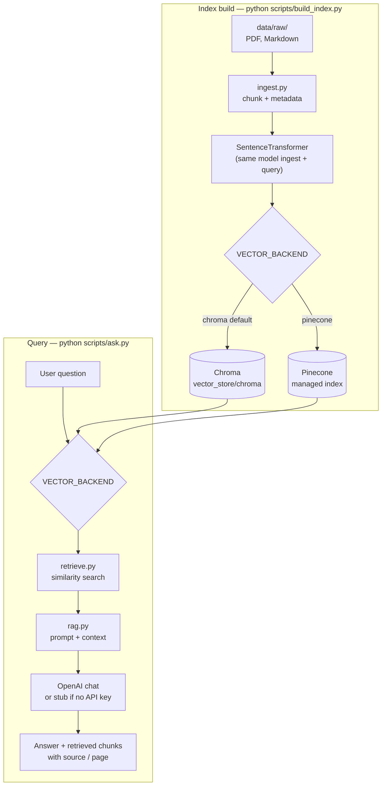

# Project A — Baseline RAG (document Q&A)

## Goals

1. Ingest PDFs/Markdown into chunks with **metadata** (source, page, section).
2. **Embeddings** + **vector database**: local **Chroma** by default, or **Pinecone** for managed production (`VECTOR_BACKEND`).
3. **Retrieval** + **prompt template**; answers **cite sources**.
4. **Evaluation:** small Q/A set + simple checks (e.g. answer grounded in retrieved chunks).

## Flow

High-level data path: **documents → chunks → embeddings → vector store**, then **question → retrieve → LLM** (with optional real answers when `OPENAI_API_KEY` is set).



**Metadata on chunks:** `source` (filename), `page` (PDF page number, or `-1` for Markdown). With Pinecone, chunk text is also stored in metadata as `text` (Pinecone has no separate document store like Chroma).

## Chroma vs Pinecone

| | **Chroma** (`VECTOR_BACKEND=chroma`, default) | **Pinecone** (`VECTOR_BACKEND=pinecone`) |
|---|-----------------------------------------------|------------------------------------------|
| Use case | Local dev, laptops, air-gapped demos | Production, multi-instance APIs, managed scale |
| Data location | Files under `vector_store/chroma/` | Pinecone project / index (cloud) |
| Secrets | None for Chroma itself | `PINECONE_API_KEY`, index name |
| Index shape | Created by `build_index.py` | You create index **384-dim, cosine** (matches `all-MiniLM-L6-v2`) |

### Pinecone setup

1. Copy `.env.example` → `.env` and set `PINECONE_API_KEY`, `VECTOR_BACKEND=pinecone`, `PINECONE_INDEX_NAME` (lowercase letters, numbers, hyphens; e.g. `baseline-rag`).
2. Create the serverless index once: `python scripts/create_pinecone_index.py` (optional `PINECONE_CLOUD` / `PINECONE_REGION`).
3. Ingest: `python scripts/build_index.py` (clears the configured Pinecone namespace, then upserts).
4. Query: `python scripts/ask.py "..."` — same code path; `retrieve.py` talks to Pinecone when `VECTOR_BACKEND=pinecone`.

Changing the embedding model changes vector **dimension**; you must create a new Pinecone index (or reconfigure) to match.

### Production deployment (typical pattern)

1. **Build-time job** (CI, batch, or admin script): clone repo, set secrets, run `python scripts/build_index.py` with `VECTOR_BACKEND=pinecone` so vectors land in Pinecone. Source documents can come from object storage or a release artifact rather than committing `data/raw/`.
2. **Runtime service** (API, worker): ship **application code only**; configure `VECTOR_BACKEND=pinecone`, `PINECONE_*`, and `OPENAI_API_KEY` via your platform’s secret manager (Kubernetes secrets, AWS Secrets Manager, etc.). No Chroma disk path is required on query nodes.
3. **Consistency**: pin `sentence-transformers` / model name in `embed_store.py` so ingest and query always use the same embeddings.
4. **Optional**: use `PINECONE_NAMESPACE` per tenant or environment so one index serves multiple isolated vector spaces.

## Layout

```
project-a-baseline-rag/
├── data/raw/           # put sample PDFs/MD here
├── src/
│   ├── config.py       # env: VECTOR_BACKEND, paths, Pinecone settings
│   ├── ingest.py       # load & chunk documents
│   ├── embed_store.py  # Chroma client + embed + upsert
│   ├── pinecone_store.py # Pinecone upsert + query
│   ├── retrieve.py     # similarity search (Chroma or Pinecone)
│   ├── rag.py          # prompt + LLM call + citations
│   └── eval.py         # placeholder for your eval harness
├── scripts/
│   ├── build_index.py  # ingest → embed → Chroma or Pinecone
│   ├── create_pinecone_index.py  # one-time serverless index (384 / cosine)
│   └── ask.py          # question → retrieve → RAG answer
├── vector_store/chroma/  # created by build_index (local Chroma)
└── requirements.txt
```

## Next steps (implementation checklist)

- [ ] Add sample documents under `data/raw/`.
- [ ] Implement chunking strategy (size + overlap) in `ingest.py`.
- [ ] Choose embedding model (local `sentence-transformers` or API).
- [ ] Run `python scripts/build_index.py` to build the index.
- [ ] Wire `rag.py` to your LLM (OpenAI, local Ollama, etc.).
- [ ] Add 5–10 labeled questions in `eval.py` and run a simple faithfulness check.

## Run

```bash
# from project-a-baseline-rag/
python scripts/build_index.py
python scripts/ask.py "Your question here"
```

**Pinecone:** after `.env` has `VECTOR_BACKEND=pinecone` and `PINECONE_*`, run `python scripts/create_pinecone_index.py` once, then the same `build_index` / `ask` commands.

Copy `.env.example` to `.env` and set `OPENAI_API_KEY` for full LLM answers (otherwise `rag.py` uses a stub that still shows retrieval).
