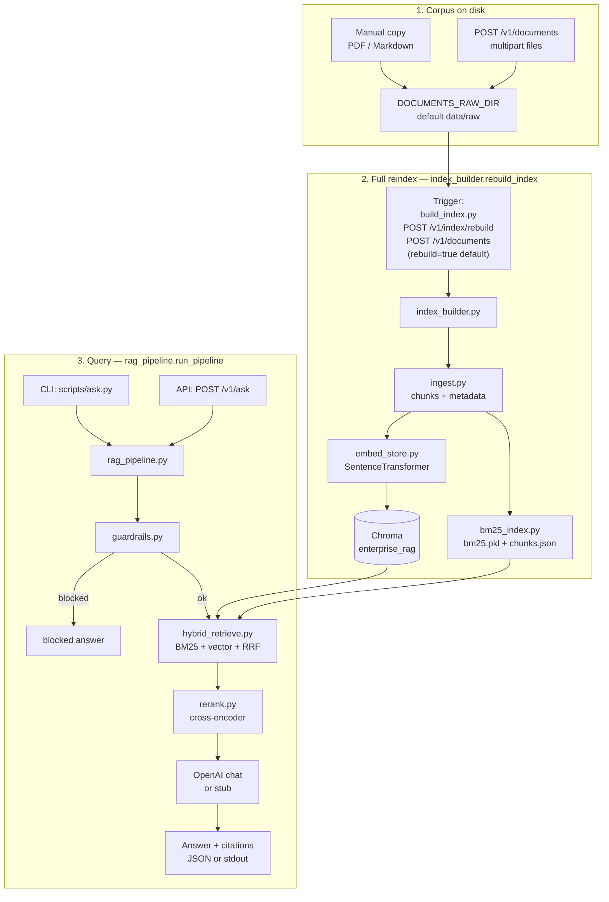

# Project B — Enterprise-style RAG

Builds on the same document Q&A ideas as **Project A**, but adds **hybrid retrieval** (lexical + dense), **cross-encoder re-ranking**, **input guardrails**, and a single **pipeline** module so the query path looks closer to what teams run in production.

**Compared to Project A:** this stack stays **on your infrastructure**—**Chroma on disk** plus **BM25 + `chunks.json`** under `vector_store/` (no managed vector SaaS in-repo). The tradeoff is richer retrieval quality and a clearer staged pipeline, at the cost of more moving parts and heavier models at query time (bi-encoder + cross-encoder).

**Interview prep:** [enterprise RAG Q&A](../docs/interview-qa-enterprise-rag.md) · [all interview docs](../docs/README.md)

---

## Goals

1. **Hybrid search:** BM25 (lexical) + dense vectors in Chroma, fused with **reciprocal rank fusion (RRF)** so keyword-heavy and semantic matches both surface.
2. **Re-ranking:** a **cross-encoder** scores each `(query, chunk)` pair so the LLM sees a sharper top‑*k* than vector or BM25 alone.
3. **Orchestration (LangChain):** `rag_pipeline.run_pipeline()` uses a LangChain runnable flow for **guardrails → retrieve → rerank → branch (blocked/no-context/error/generate)**.
4. **Guardrails:** reject empty/oversized or obviously abusive prompts; **PII-style redaction** on text used in logs (not a substitute for real DLP).
5. **Optional tool agent (LangGraph):** a separate **ReAct** path where the model **chooses** among retrieval, a safe calculator, and allowlisted HTTP GET—useful for learning tool-calling; production Q&A still defaults to the fixed pipeline.

---

## Flow

End-to-end story in three layers: **(1) corpus on disk**, **(2) full reindex** into Chroma + BM25, **(3) ask**. The **default** path (CLI `ask.py` and HTTP `POST /v1/ask`) always uses `**rag_pipeline.run_pipeline()`**. An **optional** third style is **`scripts/agent_ask.py`**: LangGraph ReAct with tools (same indexes, described under **ReAct tool agent**). All index triggers call `**index_builder.rebuild_index()`**.

### Flow summary


| Stage            | What happens                                                                                                                             | Entry points                                                                                                        |
| ---------------- | ---------------------------------------------------------------------------------------------------------------------------------------- | ------------------------------------------------------------------------------------------------------------------- |
| **Corpus**       | PDF/Markdown files accumulate under `**DOCUMENTS_RAW_DIR`** (default `data/raw/`).                                                       | Manual copy; `**POST /v1/documents**` (`src/api.py`) saves uploads with unique names.                               |
| **Reindex**      | Every file in the corpus is chunked, embedded into Chroma, and BM25 + `chunks.json` are rebuilt (**full refresh**, not incremental).     | `**python scripts/build_index.py`**; `**POST /v1/documents?rebuild=true**` (default); `**POST /v1/index/rebuild**`. |
| **Storage**      | Vectors: `**CHROMA_PERSIST_DIR`** (collection `enterprise_rag`). Lexical: `**BM25_INDEX_DIR**` (`bm25.pkl` + `chunks.json`).             | Env overrides; see **Configuration**.                                                                               |
| **Query**        | LangChain orchestration: guardrails → hybrid (BM25 + vector + RRF) → cross-encoder rerank → branch to blocked/no-context/error/generate. | `**python scripts/ask.py`**; `**POST /v1/ask**` (JSON `question`).                                                  |
| **Query (agent)** | LangGraph **ReAct** loop: the model may call **tools** (search / math / HTTP) zero or more times, then answers. Same indexes as **Query**; different entrypoint and cost profile. | `**python scripts/agent_ask.py "…"**` only (no HTTP route). Needs `**OPENAI_API_KEY**`. See **ReAct tool agent** below. |
| **HTTP surface** | FastAPI on `**python scripts/serve.py`** (default Docker port **8000**).                                                                 | `**GET /health`** (no auth); other routes use `**API_KEY**` when set. Details in **HTTP API**.                      |


### End-to-end diagram (corpus → index → ask)




### Index build (module detail)


| Step    | Module                                 | What happens                                                                                              |
| ------- | -------------------------------------- | --------------------------------------------------------------------------------------------------------- |
| Trigger | `scripts/build_index.py`, `src/api.py` | Calls `**rebuild_index()**`; rebuild is **serialized** (one at a time) via a lock in `index_builder.py`.  |
| Ingest  | `ingest.py`                            | PDFs per page and Markdown → overlapping chunks with `source`, `page` (or none for MD).                   |
| Vectors | `embed_store.py`                       | Same **bi-encoder** at build and query time (`all-MiniLM-L6-v2` by default); upsert into Chroma (cosine). |
| Lexical | `bm25_index.py`                        | `rank_bm25.BM25Okapi` over tokenized texts; `**chunks.json`** IDs must match Chroma IDs.                  |


### Query path (module detail)


| Step     | Module                         | What happens                                                                                                                      |
| -------- | ------------------------------ | --------------------------------------------------------------------------------------------------------------------------------- |
| Entry    | `scripts/ask.py`, `src/api.py` | Both invoke `**run_pipeline(question, chroma_dir, bm25_dir)**`; paths from `**config**` (`chroma_persist_dir`, `bm25_index_dir`). |
| Guards   | `guardrails.py`                | Length bounds; simple blocklist; query text for retrieval is **redacted** (email/phone); logs use redacted snippets.              |
| Hybrid   | `hybrid_retrieve.py`           | Top `bm25_k` from BM25, top `vector_k` from Chroma; **RRF** score `1 / (rrf_k + rank)` per list.                                  |
| Rerank   | `rerank.py`                    | Cross-encoder on fused candidates; keep top `rerank_top_n`.                                                                       |
| Generate | `prompt_orchestration.py`      | LangChain `ChatPromptTemplate` + `ChatOpenAI`; if key missing, stub preview path; API returns JSON + `debug_json`-style payload.  |


### Prompt orchestration (LangChain, deep path)

Project B now uses a **LangChain runnable chain** to make query-time flow explicit and extensible without changing retrieval modules:

1. **Guardrails step** (`check_query`) validates and redacts query text.
2. **Retrieve step** calls `hybrid_retrieve` with BM25 + dense + RRF.
3. **Rerank step** calls `rerank` and builds citation-ready context blocks.
4. **Branch step** (`RunnableBranch`) routes to:
  - blocked answer (policy fail),
  - no-context answer (empty top chunks),
  - error answer (index/retrieval/LLM failure),
  - generation path (`ChatPromptTemplate -> ChatOpenAI -> StrOutputParser`).

This keeps the existing service contract (`answer`, `retrieved`, flags, `error_code`) while giving a framework-native orchestration layer where you can later add routers/tools/multi-step subflows.

### ReAct tool agent (optional — LangGraph)

This path is for **tool-calling** and **ReAct** (“reason → act → observe → …”) patterns. It is **not** wired to `POST /v1/ask`; use it from the CLI when you want the **model** to decide *whether* to search the corpus, do math, or fetch an internal URL.

#### Fixed pipeline vs tool agent (pick one mentally)

| | **`run_pipeline` / `ask.py` / `POST /v1/ask`** | **`agent_ask.py` (LangGraph)** |
| --- | --- | --- |
| **Control flow** | Code always runs: guardrails → retrieve → rerank → one LLM call (with branching for errors). | LLM chooses **which tools** to run and **how many** turns (search/math/HTTP can repeat). |
| **Retrieval** | Always runs when not blocked. | Runs **only if** the model calls `search_documents`. |
| **Best for** | Production Q&A, benchmarks, stable latency. | Experiments, multi-step questions, learning agents. |
| **Needs** | Optional `OPENAI_API_KEY` (stub without it on the fixed path). | **`OPENAI_API_KEY` required** (tool calling needs a live chat model). |

Both paths share the **same** Chroma + BM25 indexes and **`check_query`** guardrails on the way in.

#### What runs under the hood

1. **`src/agent_runner.py`** — `create_react_agent(ChatOpenAI, tools, prompt=...)` from **LangGraph**, then `invoke` with your user message.
2. **`src/agent_tools.py`** — three tools (see table below). `search_documents` calls `hybrid_retrieve` + `rerank` + `format_context` (same building blocks as the fixed pipeline).
3. **`scripts/agent_ask.py`** — prints the final answer and a short **message trace** (useful to see tool calls).

Extra dependencies (already in `requirements.txt`): **`langgraph`**, **`httpx`**.

#### Tools the model can call

| Tool | When to use it (from the model’s perspective) | Notes |
| ---- | ---------------------------------------------- | ----- |
| **`search_documents`** | User asks about **content in the indexed corpus** (policies, products, docs you had to ingest). | Same hybrid + rerank stack as the main app; returns citation-style context blocks. |
| **`calculator`** | User asks for **numeric arithmetic** you should not do in your head (`(19+23)*2`, etc.). | Safe **`ast`** evaluator: numbers and `+`, `-`, `*`, `/`, `**` (power), parentheses only. |
| **`fetch_internal_http`** | User gives an **internal URL** you must read (e.g. `http://127.0.0.1:8000/health`). | **GET only**, short body cap. Host must appear in **`AGENT_HTTP_ALLOWLIST`** (comma-separated; default `127.0.0.1,localhost`). |

#### Quick start

Prerequisites: same as **Run** (venv, `pip install -r requirements.txt`, `build_index` so search is meaningful).

```bash
cd project-b-enterprise-rag
source .venv/bin/activate   # if you use a venv
export OPENAI_API_KEY=...   # required for the agent

# Example: mixes “what’s in the docs?” with arithmetic (model may call search + calculator)
python scripts/agent_ask.py "Summarize what the indexed documents cover and compute (19 + 23) * 2."

# Optional: allow your internal API hostname for fetch_internal_http
export AGENT_HTTP_ALLOWLIST=127.0.0.1,localhost,api.internal
```

If `OPENAI_API_KEY` is missing, `run_agent` returns a clear message instead of hanging.

#### Files to read

| File | Purpose |
| ---- | ------- |
| `src/agent_tools.py` | Tool definitions (`@tool`) and `build_agent_tools(...)`. |
| `src/agent_runner.py` | `run_agent(question, ...)` — guardrails, graph build, invoke, extract final text. |
| `scripts/agent_ask.py` | CLI entry and debug printing of messages. |

### Retrieval tuning defaults

Override in `**run_pipeline()`** / `**hybrid_retrieve()**` (or extend `**config` / `ask.py` / `api.py**` to read from env).


| Parameter      | Default | Role                                       |
| -------------- | ------- | ------------------------------------------ |
| `bm25_k`       | 20      | Lexical hits fed into RRF.                 |
| `vector_k`     | 20      | Dense hits fed into RRF.                   |
| `rrf_k`        | 60      | RRF smoothing constant.                    |
| `fusion_top_n` | 15      | Candidates after fusion, before reranking. |
| `rerank_top_n` | 5       | Chunks passed to the LLM.                  |


---

## Why this shape (elaboration)

- **Dense-only** retrieval (Project A’s default path) can miss exact keywords, SKUs, or rare terms; **BM25** recovers those. **RRF** avoids picking a single score scale: you only need ranked lists from each retriever.
- **Cross-encoders** see query and passage together, so they are slower than bi-encoders but **much more accurate** for “which of these 15 paragraphs actually answers the question?” Use them on a **small** fused set, not the whole corpus.
- **Guardrails** here are intentionally minimal: they show *where* policy hooks go (length, blocklist, redacted logs). Swap in your org’s moderation, allowlists, and real DLP as needed.

**Models (defaults):**


| Role                              | Model                                    |
| --------------------------------- | ---------------------------------------- |
| Chunk embedding + query embedding | `sentence-transformers/all-MiniLM-L6-v2` |
| Reranking                         | `cross-encoder/ms-marco-MiniLM-L-6-v2`   |


Pin these (and package versions) in production so build-time and query-time vectors stay aligned.

---

## Prerequisite

Complete **Project A** first, or skim its ingest/embed flow. This project is **standalone**: use `**DOCUMENTS_RAW_DIR`** (default `data/raw/`), `**scripts/build_index.py**` or the **HTTP API** for corpus + index, then `**ask.py`** or `**POST /v1/ask**`. Understanding Project A makes the baseline vs hybrid comparison clearer.

---

## Layout

```
project-b-enterprise-rag/
├── data/
│   ├── raw/                 # corpus PDFs / Markdown
│   └── eval/                # JSONL gold sets for offline eval
├── src/
│   ├── config.py            # project root paths, loads `.env`
│   ├── ingest.py
│   ├── embed_store.py
│   ├── bm25_index.py        # persisted BM25 + chunks JSON
│   ├── hybrid_retrieve.py   # BM25 + vector + RRF
│   ├── rerank.py            # cross-encoder
│   ├── guardrails.py
│   ├── rag_pipeline.py      # end-to-end
│   ├── prompt_orchestration.py  # LangChain query flow
│   ├── agent_tools.py       # LangGraph tools: search_documents, calculator, fetch_internal_http
│   ├── agent_runner.py      # LangGraph create_react_agent + run_agent()
│   ├── observability.py     # metrics, readiness, logging (Phase 4)
│   ├── eval_suite.py        # offline eval helpers
│   ├── index_builder.py     # shared reindex logic (CLI + API)
│   ├── api.py               # FastAPI: upload, rebuild, ask
│   └── eval.py
├── vector_store/chroma/     # created by build_index
├── vector_store/bm25/       # bm25.pkl + chunks.json
├── Dockerfile               # runtime image (indexes mounted or synced)
├── .dockerignore
└── scripts/
    ├── build_index.py
    ├── ask.py
    ├── agent_ask.py         # optional LangGraph ReAct CLI (tool calling)
    ├── run_eval.py          # JSONL eval → JSON report
    └── serve.py             # uvicorn — HTTP API
```

---

## Configuration

Copy `.env.example` → `.env`:

- `**OPENAI_API_KEY**` — enables full answers; without it, `rag_pipeline` returns a stub plus the top reranked chunk preview. **Required** for `**scripts/agent_ask.py**` (the ReAct agent does not run in stub mode).
- `**OPENAI_CHAT_MODEL**` — defaults to `gpt-4o-mini` (used by both the fixed pipeline and the agent).
- `**AGENT_HTTP_ALLOWLIST**` — comma-separated hostnames the **`fetch_internal_http`** tool may call (default `**127.0.0.1,localhost**`). Only relevant when using **`agent_ask.py`**.

Tuning `bm25_k`, `vector_k`, `fusion_top_n`, and `rerank_top_n` is done in code today (`run_pipeline` / `hybrid_retrieve`); you can extend `config.py` or `ask.py` to read them from the environment if you want.

**Production path overrides** (optional): set `**CHROMA_PERSIST_DIR`** and `**BM25_INDEX_DIR**` to absolute paths when indexes live on a volume (Kubernetes PVC, bind mount, etc.). Defaults remain `vector_store/chroma` and `vector_store/bm25` under the project root.

**Corpus directory:** `**DOCUMENTS_RAW_DIR`** sets where uploads and `**scripts/build_index.py**` look for PDFs/Markdown (default `**data/raw/**`).

**API authentication (optional):** set `**API_KEY`** so upload, rebuild, ask, and config routes require `**X-API-Key**` or `**Authorization: Bearer**`. `**/health**`, `**/ready**`, and `**/metrics**` stay unauthenticated by default (Kubernetes probes + Prometheus). Set `**METRICS_REQUIRE_AUTH=1**` to require the same API key on `**/metrics**` (scrapers must send the key).

Optional: set `**HF_TOKEN**` for Hugging Face Hub if you hit rate limits downloading embedding or reranker weights. Set `**HF_HOME**` (or rely on default cache) so repeated deploys reuse downloaded model weights.

**Deploy identity (Phase 4):** set `**BUILD_ID`** or `**GIT_SHA**` and optional `**SERVICE_VERSION**` so `**GET /health**` and `**GET /v1/version**` return a stable build label for logs and dashboards.

---

## Run

```bash
cd project-b-enterprise-rag
python3 -m venv .venv && source .venv/bin/activate
pip install -r requirements.txt
cp .env.example .env
# add PDFs/MD to data/raw/
python scripts/build_index.py
python scripts/ask.py "Your question"
```

`ask.py` prints the answer and a **Debug** block (`debug_json`) with `blocked`, `rerank_score`, and chunk previews.

**Optional tool agent:** after `OPENAI_API_KEY` is set, run `**python scripts/agent_ask.py "Your question"**` to exercise LangGraph ReAct with `search_documents`, `calculator`, and `fetch_internal_http`. See **ReAct tool agent (optional — LangGraph)** above for behavior and **`AGENT_HTTP_ALLOWLIST`**.

**Eval smoke test:** from the project directory, run `python -m src.eval` after `build_index` (same Chroma/BM25 paths as `ask.py`).

**Offline eval report (gold JSONL):** add rows to `data/eval/*.jsonl` (see `data/eval/gold_qa.example.jsonl`), then:

```bash
python scripts/run_eval.py --input data/eval/gold_qa.example.jsonl --output eval_reports/latest.json
```

---

## Phase 4 — APIs, training-ish workflows, MLOps / LLMOps

**Goal:** treat the service like a deployed model: **versioned**, **measured**, and **debuggable**.


| Piece               | What you get                                                                                                                                                                                                                                      |
| ------------------- | ------------------------------------------------------------------------------------------------------------------------------------------------------------------------------------------------------------------------------------------------- |
| **HTTP surface**    | Existing FastAPI routes; `**X-Request-ID`** is accepted or generated and echoed on responses; `**POST /v1/ask**` responses include `**request_id**`.                                                                                              |
| **Probes**          | `**GET /health`** — liveness (`status`, `version`, `build_id`). `**GET /ready**` — readiness (**503** if Chroma dir empty or BM25 artifacts missing). Wire these to `**livenessProbe`** / `**readinessProbe**`.                                   |
| **Metrics**         | `**GET /metrics`** — Prometheus text (`enterprise_rag_ask_*`, `enterprise_rag_index_rebuild_*`). Scrape from your collector or Grafana Agent.                                                                                                     |
| **Structured logs** | Set `**LOG_JSON=1`** for one JSON object per line (stdout); set `**LOG_LEVEL**`.                                                                                                                                                                  |
| **Eval loop**       | JSONL gold file + `**scripts/run_eval.py`** produces a JSON report (latency, keyword overlap, error counts). Use after index or prompt changes like a regression check—not “training,” but the same **iterate → measure → ship** rhythm as MLOps. |


Docker build example with a traceable image:

```bash
docker build --build-arg BUILD_ID="$(git rev-parse --short HEAD)" -t enterprise-rag:latest .
```

---

## HTTP API (upload + ask)

See **Flow** for how uploads and `**POST /v1/ask`** fit into the same corpus → reindex → RAG path as the CLI.

The **FastAPI** app lets you **upload PDF/Markdown files** and **rebuild the index** without copying files by hand.


| Endpoint                 | Auth             | Description                                                                                                                                                                                                              |
| ------------------------ | ---------------- | ------------------------------------------------------------------------------------------------------------------------------------------------------------------------------------------------------------------------ |
| `GET /health`            | —                | Liveness: `status`, `version`, `build_id`.                                                                                                                                                                               |
| `GET /ready`             | —                | Readiness: index artifacts present (**503** if not ready).                                                                                                                                                               |
| `GET /metrics`           | Optional         | Prometheus scrape. Set `**METRICS_REQUIRE_AUTH=1`** to require `**API_KEY**`.                                                                                                                                            |
| `GET /v1/version`        | If `API_KEY` set | Service name, version, `**build_id**` (for deploy tracing).                                                                                                                                                              |
| `GET /v1/config/paths`   | If `API_KEY` set | Shows corpus and index directories (for debugging).                                                                                                                                                                      |
| `POST /v1/documents`     | If `API_KEY` set | Multipart upload: one or more `.pdf` / `.md` files saved under `**DOCUMENTS_RAW_DIR**` (default `data/raw/`). Query `rebuild=false` to only save files; default `**rebuild=true**` runs a **full reindex** after upload. |
| `POST /v1/index/rebuild` | If `API_KEY` set | Full reindex from whatever is already on disk in the corpus dir.                                                                                                                                                         |
| `POST /v1/ask`           | If `API_KEY` set | JSON `{"question": "..."}` → answer + flags + `**request_id`**; **503** if the LLM/index path failed (see **No answer / errors** below).                                                                                 |


If `**API_KEY`** is set in `.env`, protected routes require header `**X-API-Key: <key>**` or `**Authorization: Bearer <key>**`. If unset, all routes are open (fine for local dev only).

**Run the server:**

```bash
python scripts/serve.py
# or: uvicorn src.api:app --host 0.0.0.0 --port 8000
```

**Example (upload + reindex + ask):**

```bash
curl -s -X POST "http://127.0.0.1:8000/v1/documents" \
  -F "files=@./data/raw/SAMPLE.md"
curl -s -X POST "http://127.0.0.1:8000/v1/ask" \
  -H "Content-Type: application/json" \
  -d '{"question":"What topics are in the docs?"}'
```

**Behavior notes:**

- Uploads are stored with a **unique prefix** on the filename to avoid collisions; a **rebuild** re-ingests **every** file under the corpus directory (uploaded + any files you added manually).
- Reindexing can be **slow** on large corpora (embedding + Chroma + BM25); for production, run rebuilds in a **background worker** or separate job if you outgrow synchronous uploads.
- To **remove** a document, delete it from the corpus directory (or replace the volume) and call `**POST /v1/index/rebuild`**.
- OpenAPI docs: `**http://127.0.0.1:8000/docs**` when the server is running.

**No answer / errors (enforced in `rag_pipeline.run_pipeline`):**


| Situation                                                                                 | Behavior                                                                                                                                                                                        | HTTP (`POST /v1/ask`)                        |
| ----------------------------------------------------------------------------------------- | ----------------------------------------------------------------------------------------------------------------------------------------------------------------------------------------------- | -------------------------------------------- |
| **Nothing retrieved** after hybrid + rerank (empty index or no overlap with the question) | Fixed explanation in `answer`; **no LLM call** (saves cost).                                                                                                                                    | **200**, `no_context: true`, `error: false`. |
| **Question not answerable from context** when chunks *do* exist                           | Prompt asks the model to say it lacks enough information; behavior is still LLM-dependent.                                                                                                      | **200** unless the LLM call fails.           |
| **Missing index files** (e.g. BM25/Chroma not built or wrong path)                        | Clear `answer`; `error_code`: `index_missing` or `retrieval_failed`.                                                                                                                            | **503**, `error: true`.                      |
| **OpenAI/network** (timeouts, connection errors, 5xx, rate limits)                        | User-facing `answer`; `error_code` such as `llm_network`, `llm_rate_limit`, `llm_upstream`. Details are logged server-side (`error_detail` in pipeline dict; not required in client responses). | **503**, `error: true`.                      |


CLI `**ask.py`** prints the same `answer` text; it does not map status codes (check stderr/logs for stack traces only on unexpected bugs).

---

## Production deployment (Chroma + BM25, no Pinecone)

Treat production as **two concerns**: (1) **building and publishing indexes**, (2) **running query workers** that read those indexes and call the LLM. Use `**scripts/serve.py`** (Docker `CMD` defaults to this) or call `run_pipeline` from your own service; the FastAPI app in `src/api.py` is a reasonable default for upload + Q&A behind your gateway and `**API_KEY**`.

### 1. What you ship and what you store


| Artifact           | Contents                                          | Typical storage                                                                                                                |
| ------------------ | ------------------------------------------------- | ------------------------------------------------------------------------------------------------------------------------------ |
| **Chroma**         | SQLite + HNSW data under `CHROMA_PERSIST_DIR`     | Tarball or rsync to **object storage** (S3, GCS, Azure Blob); version with a **build ID** or git SHA.                          |
| **BM25**           | `bm25.pkl` + `chunks.json` under `BM25_INDEX_DIR` | Same bundle version as Chroma—**must stay in lockstep** with the Chroma build (same chunk IDs).                                |
| **Source PDFs/MD** | Raw documents                                     | Object storage or internal CMS; sync into `**DOCUMENTS_RAW_DIR`** or use `**POST /v1/documents**` against a volume-backed API. |
| **Secrets**        | `OPENAI_API_KEY`, optional `HF_TOKEN`             | **Secret manager** (AWS Secrets Manager, GCP Secret Manager, Kubernetes Secrets); never commit `.env`.                         |


**Cold start / models:** SentenceTransformers and the cross-encoder download from Hugging Face on first use. In production, either **pre-download in the image** (build step: small script that imports and encodes dummy text), or mount a **read-only `HF_HOME` volume** filled in CI so query pods start without Hub dependency.

### 2. Index build job (batch / CI)

Run whenever documents change (or on a schedule).

1. Check out **pinned** `requirements.txt` (or use a **lockfile** you generate in CI) so embedder versions match query services.
2. Stage documents into a workspace path (clone from object storage, artifact, or mount).
3. Run `**python scripts/build_index.py`** (uses `**DOCUMENTS_RAW_DIR**`, default `data/raw`)—in CI, sync files into that directory first, or set `**DOCUMENTS_RAW_DIR**` to your staging path.
4. **Validate** output: non-empty `vector_store/chroma` and `vector_store/bm25/chunks.json` + `bm25.pkl`.
5. **Archive and upload** the two directories (same version label), e.g. `s3://your-bucket/rag-indexes/<BUILD_ID>/chroma.tar.gz` and `.../bm25.tar.gz` (or one tarball containing both).
6. Record `**BUILD_ID`** in your release registry so runtime knows which index to mount.

### 3. Query runtime (services)

1. **Image:** build from the `**Dockerfile`** in this project (or equivalent base + `pip install -r requirements.txt` + copy `src/` and `scripts/`).
2. **Before or at container start:** download and extract the index tarball(s) into a **writable volume**, or use a **shared filesystem** (EFS, NFS, Azure Files) that already contains the built `chroma` and `bm25` trees.
3. **Environment:** set `CHROMA_PERSIST_DIR` and `BM25_INDEX_DIR` to those paths; inject `OPENAI_API_KEY` and optional `OPENAI_CHAT_MODEL`, `HF_HOME`, `HF_TOKEN`.
4. **Process model:** use the built-in `**src.api`** (`scripts/serve.py`) or call `run_pipeline(question, chroma_dir, bm25_dir)` yourself; `config` resolves paths from env.
5. **Scaling:** Chroma’s persistent client is backed by **local files**. Safe patterns: **read-heavy** replicas mounting the **same read-only** index volume (verify Chroma’s docs for your version if you need concurrent readers); **avoid** multiple writers to the same DB. For **many concurrent heavy** queries, profile CPU (embed + cross-encoder) and scale **horizontal replicas** with the **same** frozen index image.

### 4. Observability and safety

- **Logging:** the pipeline already logs redacted query/answer previews; route logs to your aggregator and **strip** sensitive fields at the edge if needed.
- **Metrics:** track latency per stage (retrieve, rerank, LLM), error rate, and guardrail blocks.
- **Guardrails:** replace the demo blocklist with your **policy** before external traffic.

### 5. Docker quick reference

From `project-b-enterprise-rag/`:

```bash
# Build runtime image
docker build -t enterprise-rag:latest .

# Example: build indexes on host, then run with mounted vector_store
docker run --rm -e OPENAI_API_KEY -v "$(pwd)/vector_store:/app/vector_store" enterprise-rag:latest \
  python scripts/ask.py "Your question"

# Example: indexes on a custom mount
docker run --rm -e OPENAI_API_KEY \
  -e CHROMA_PERSIST_DIR=/data/chroma -e BM25_INDEX_DIR=/data/bm25 \
  -v /path/to/indexes/chroma:/data/chroma -v /path/to/indexes/bm25:/data/bm25 \
  enterprise-rag:latest python scripts/ask.py "Your question"
```

The default image `**CMD**` runs `**python scripts/serve.py**` (FastAPI on port **8000**). Override `**CMD`** if you only need `ask.py` or a custom entrypoint.

### 6. When this layout stops being enough

If you need **many writers**, **multi-region active-active**, or **very large** corpora on shared nothing nodes, you will eventually **replace on-disk Chroma** with a **managed or clustered vector database** and keep BM25 (or lexical search) as a separate tier—still without requiring any specific vendor; plan that migration at the data path boundary (retrieve module) rather than in the LLM prompt layer.

---

## Project A vs B (quick reference)


|             | **Project A**            | **Project B**                 |
| ----------- | ------------------------ | ----------------------------- |
| Retrieval   | Dense similarity only    | BM25 + dense + RRF            |
| Refinement  | None                     | Cross-encoder rerank          |
| Vector DB   | Chroma **or** Pinecone   | Chroma on disk (+ BM25 files) |
| Safety      | Minimal                  | Guardrails + log redaction    |
| Query entry | `retrieve.py` + `rag.py` | `rag_pipeline.run_pipeline()` |


---

## Checklist

- Tune `rrf_k`, `bm25_k`, `vector_k`, and `rerank_top_n` for your corpus.
- Replace simple guardrails with policy from your org (allowlists, regex, LLM moderation).
- LangChain runnable orchestration with explicit query-time branching.
- Optional **LangGraph** agent (`agent_tools.py`, `agent_runner.py`, `scripts/agent_ask.py`) for tool-calling demos; keep **`POST /v1/ask`** on the fixed pipeline for services.
- Phase 4: `/metrics`, `/ready`, JSONL eval (`scripts/run_eval.py`), `**BUILD_ID`** / structured logs.
- Pin dependencies and index **build ID** in production; version Chroma + BM25 artifacts together.
- If you outgrow single-node Chroma, plan a retrieve-layer swap to a clustered or managed vector store; keep BM25 or move lexical to a search service—no change required to the “LLM + citations” contract if IDs and chunk text stay aligned.

