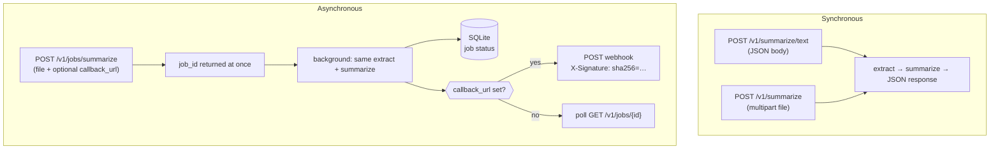
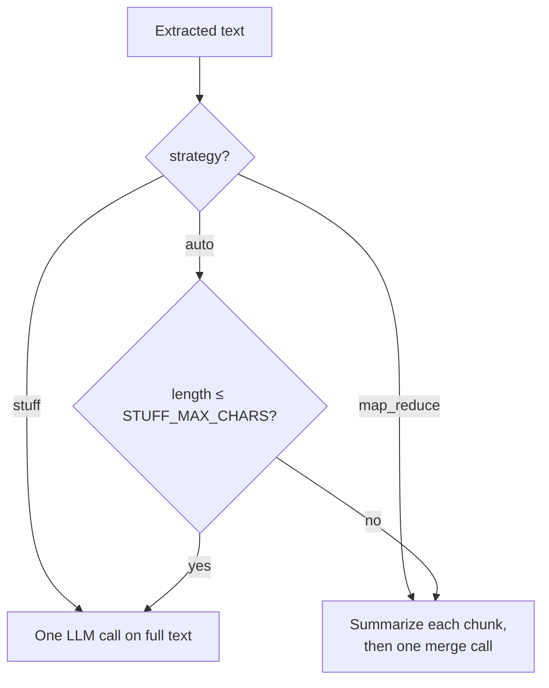

# Project F — Document summarization + engineering / integration

This project adds **first-class document summarization** (not just RAG Q&A) and **integration-oriented patterns**: optional API keys, **async jobs** with SQLite state, **HMAC-signed webhooks**, a **connector interface** for external document sources, **Prometheus** metrics, Docker, and CI.

## Capabilities

| Area | What you get |
|------|----------------|
| **Summarization** | **Stuff** (single LLM pass) for shorter text; **map–reduce** (chunk summaries → final summary) when text exceeds `STUFF_MAX_CHARS`. **Stub** mode without `OPENAI_API_KEY` (truncates with a notice). |
| **Formats** | PDF (text extraction), Markdown, plain text via upload or raw JSON body. |
| **API** | `POST /v1/summarize/text` (JSON), `POST /v1/summarize` (multipart), `POST /v1/jobs/summarize` (async + optional `callback_url`), `GET /v1/jobs/{id}`. |
| **Integration** | Webhook delivery with `X-Signature`; `DocumentSource` ABC in `src/connectors/`; see [docs/integration.md](docs/integration.md). |
| **Engineering** | FastAPI, Docker, Ruff, pytest, GitHub Actions CI (monorepo). |

## Flow

### 1. Two ways to get a summary

**Synchronous** — you wait for the HTTP response (good for interactive use).

**Asynchronous** — you get a `job_id` immediately; the server summarizes in the background and optionally **POSTs** the result to your `callback_url`.



### 2. What “summarize” does inside

1. **Input** — Raw text from JSON, or bytes from a file → **extract** text (PDF / Markdown / TXT).
2. **LLM or stub** — If `OPENAI_API_KEY` is set, call OpenAI; otherwise return a **truncated stub** (useful for tests and dry runs).
3. **Strategy** — `auto` picks the path from document length; you can force `stuff` or `map_reduce`.



### 3. Optional integration touchpoints

| Step | What to use |
|------|----------------|
| Secure the API | Set `API_KEY`; send `X-API-Key` or `Bearer` on `/v1/*` |
| Push results to your system | `callback_url` on async jobs; verify `X-Signature` with `WEBHOOK_SECRET` |
| Pull documents from elsewhere | Implement `DocumentSource` in code (see [docs/integration.md](docs/integration.md)) |
| Observe production | Scrape `GET /metrics` (Prometheus) |

## Quick start

```bash
cd project-f-document-summarization
python3 -m venv .venv && source .venv/bin/activate
pip install -r requirements.txt
cp .env.example .env
# Set OPENAI_API_KEY for real summaries; omit for stub mode.
uvicorn src.api:app --reload --host 0.0.0.0 --port 8020
```

Examples:

```bash
curl -s -X POST http://127.0.0.1:8020/v1/summarize/text \
  -H "Content-Type: application/json" \
  -d '{"text":"Long paragraph or pasted doc...","strategy":"auto"}'

curl -s -X POST http://127.0.0.1:8020/v1/summarize \
  -F "file=@data/sample.txt" \
  -F "strategy=auto"
```

## Configuration

| Variable | Default | Purpose |
|----------|---------|---------|
| `API_KEY` | unset | If set, required on `/v1/*` via `X-API-Key` or `Bearer` |
| `OPENAI_API_KEY` | unset | Enables OpenAI summarization |
| `OPENAI_CHAT_MODEL` | `gpt-4o-mini` | Chat model name |
| `JOBS_DB` | `data/jobs.db` | SQLite path for async jobs |
| `WEBHOOK_SECRET` | `dev-change-me` | HMAC key for outbound webhooks |
| `CHUNK_SIZE` / `CHUNK_OVERLAP` | 3500 / 400 | Map–reduce chunking |
| `STUFF_MAX_CHARS` | 12000 | Below this, `auto` uses single-pass summarization |

## Docker

```bash
docker build -t project-f-summarization:local .
docker run --rm -p 8020:8020 -e OPENAI_API_KEY="$OPENAI_API_KEY" project-f-summarization:local
```

## Tests

```bash
ruff check src tests
pytest
```

## Monorepo CI

Workflow: `.github/workflows/project-f-ci.yml` (path filter on `project-f-document-summarization/**`).

## Interview prep

[Document summarization & integration Q&A](../docs/interview-qa-document-summarization.md) (all interview docs: [`docs/README.md`](../docs/README.md))
